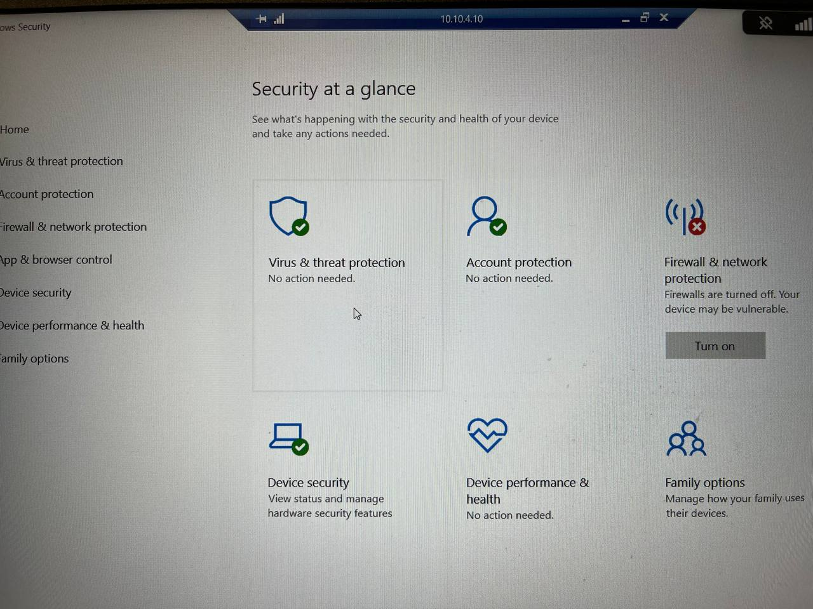

---
## Front matter
lang: ru-RU
title: Лабораторная Работа №1. 
subtitle: Кибербезопасность предприятия
author:
 	- Боровиков Даниил Александрович,
	- Хрусталев Влад Николаевич,
	- Гисматуллин Артем,
	- Тщесноков Артёмий Pavlovich,
	- Коннова Татьяна,
	- Нефедова Наталья,
	- Уткина Алина,
	- Бансимба Клодели

institute:
  - Российский университет дружбы народов им. Патриса Лумумбы, Москва, Россия

## i18n babel
babel-lang: russian
babel-otherlangs: english

## Formatting pdf
toc: false
toc-title: Содержание
slide_level: 2
aspectratio: 169
section-titles: true
theme: metropolis
header-includes:
 - \metroset{progressbar=frametitle,sectionpage=progressbar,numbering=fraction}
 - '\makeatletter'
 - '\beamer@ignorenonframefalse'
 - '\makeatother'

## Fonts
mainfont: Arial
romanfont: Arial
sansfont: Arial
monofont: Arial
---

## Задание

Сценарий №2

Защита контроллера домена предприятия

Внешний злоумышленник находит в интернете сайт Компании и решает провести атаку на него с целью получения доступа к внутренним ресурсам компании. Обнаружив несколько уязвимостей на внешнем периметре и закрепившись на одном из серверов, Злоумышленник проводит разведку корпоративной сети с целью захватить контроллер домена.
Квалификация нарушителя средняя. Он умеет использовать инструментарий для проведения атак, а также знает техники постэксплуатации.
Злоумышленник обладает опытом проведения почтовых фишинговых рассылок.

## Сканирование на SQL-инъекции

{ #fig:001 width=70% }

## Детектирование SQL-инъекции

{ #fig:002 width=70% }

## Загрузка вредоносного файла

{ #fig:003 width=70% }

## Инцидент атака на веб сервер

{ #fig:004 width=70% }

## RDP Brute-force

{ #fig:005 width=70% }

## Инцидент атака а хост, Brute-force

{ #fig:006 width=70% }

 
## Инцидент Атака на Administration WS

{ #fig:024 width=70% }

## PHP reverse shell

{ #fig:007 width=50% }

## Поиск места уязвимого параметра

{ #fig:008 width=50% }

## Измененная функция actionView

{ #fig:009 width=50% }

## Удаление вредоносного файла

{ #fig:010 width=50% }

## Список установленных соединений

{ #fig:011 width=50% }

## Завершение сессий

{ #fig:012 width=50% }

## Удаление записи DisableAntiSpyware

{ #fig:020 width=50% }

## Включение Real-time Protection

{ #fig:013 width=50% }

## Соединение с машиной нарушителя

{ #fig:019 width=50% }

## Остановка процесса

{ #fig:018 width=50% }

## Логи подключений по RDP

{ #fig:017 width=50% }

## Изменение пароля
 
{ #fig:016 width=50% }

## Лог добавления нового пользователя

{ #fig:014 width=50% }

## Удаление пользователя

{ #fig:015 width=50% }

## Итоговый результат

{ #fig:023 width=70% }

## Вывод

В рамках учебно-практического занятия на базе программного комплекса обучения методам обнаружения, анализа и устранения последствий компьютерных атак «Ampire» мы выполнили сценарий №2 «Защита контроллера домена предприятия». 
