---
## Front matter
lang: ru-RU
title: Лабораторная работа №3
subtitle: Кибербезопасность предприятия
author:
  - Боровиков Даниил
  - Хрусталев Влад 
  - Гисматуллин Артём
  - Чесноков Артёмий
  - Коннова Татьяна
  - Нефедова Наталья
  - Уткина Алина
  - Бансимба Клодели

institute:
  - Российский университет дружбы народов, Москва, Россия

## i18n babel
babel-lang: russian
babel-otherlangs: english

## Formatting pdf
toc: false
toc-title: Содержание
slide_level: 2
aspectratio: 169
section-titles: true
theme: metropolis
header-includes:
 - \metroset{progressbar=frametitle,sectionpage=progressbar,numbering=fraction}
 - '\makeatletter'
 - '\beamer@ignorenonframefalse'
 - '\makeatother'
 
## Fonts
mainfont: PT Serif
romanfont: PT Serif
sansfont: PT Sans
monofont: PT Mono
mainfontoptions: Ligatures=TeX
romanfontoptions: Ligatures=TeX
sansfontoptions: Ligatures=TeX,Scale=MatchLowercase
monofontoptions: Scale=MatchLowercase,Scale=0.9
---

## Задачи

В рамках лабораторной работы проведен анализ трех уязвимых узлов с различными типами уязвимостей. Использовались инструменты мониторинга и защиты: ViPNet IDS NS, Security Onion, 
а также встроенные средства операционных систем для обнаружения и нейтрализации атак.

## Используемые инструменты

- **ViPNet IDS NS** - обнаружение сетевых атак
- **Security Onion** - мониторинг сетевой безопасности
- **Системные утилиты** (ss, netstat, taskkill) - анализ процессов и соединений

# Процесс выполнения лабораторной работы

# Уязвимый узел: WpDiscuz

## Уязвимый узел: WpDiscuz

{ #fig:001 width=70%, height=70% }

## Уязвимый узел: WpDiscuz

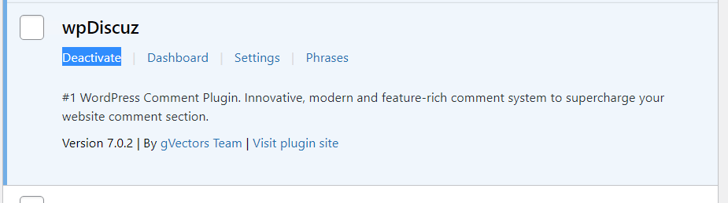{ #fig:002 width=70%, height=70% }

## Уязвимый узел: WpDiscuz

{ #fig:003 width=70%, height=70% }

## Уязвимый узел: WpDiscuz

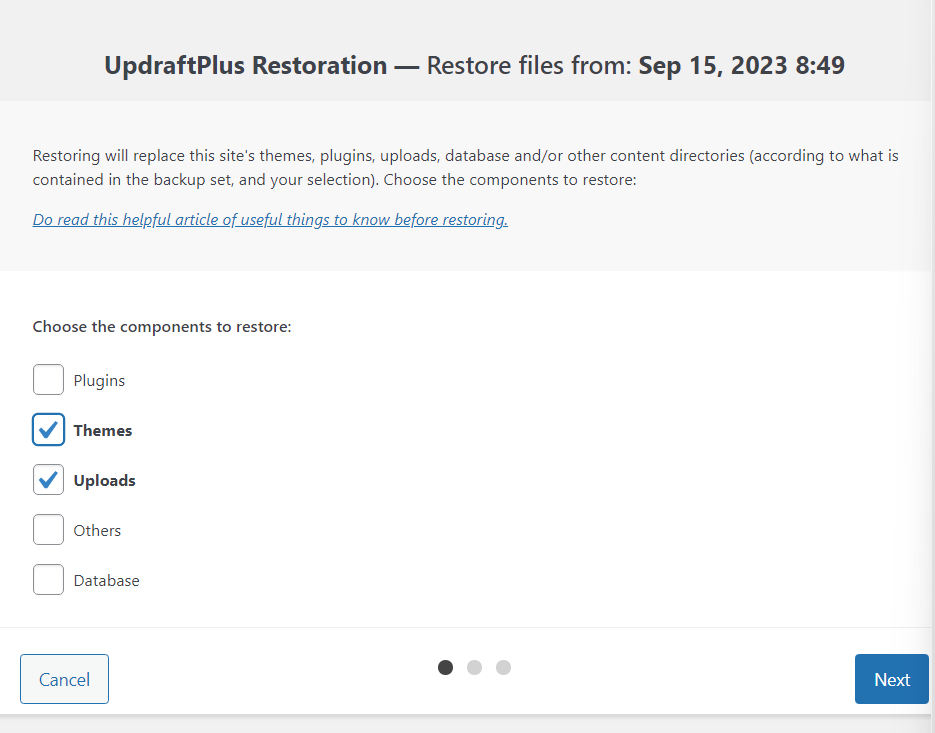{ #fig:012 width=70%, height=70% }

## Уязвимый узел: WpDiscuz

{ #fig:027 width=70%, height=70% }

## Уязвимый узел: WpDiscuz

{ #fig:004 width=70%, height=70% }

## Проверка устранения

- Отсутствие активных соединений с хостом нарушителя
- Восстановлена оригинальная версия сайта
- Плагин деактивирован или обновлен

# Уязвимый узел: RocketChat

## Уязвимый узел: RocketChat

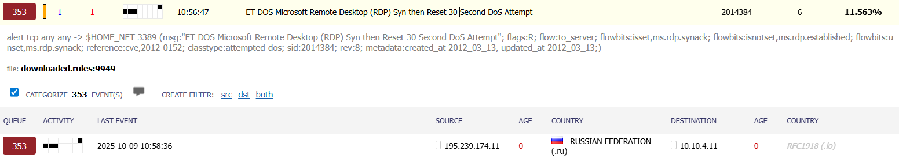{ #fig:021 width=70%, height=70% }

## Уязвимый узел: RocketChat

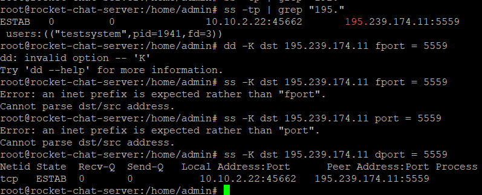{ #fig:016 width=70%, height=70% }

## Уязвимый узел: RocketChat

{ #fig:009 width=70%, height=70% }

## Уязвимый узел: RocketChat

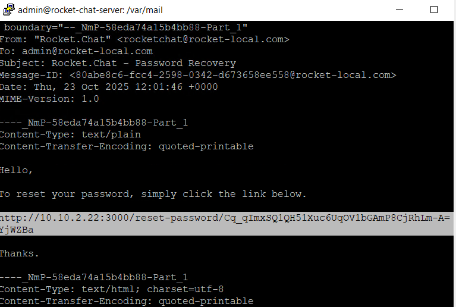{ #fig:013 width=70%, height=70% }

## Уязвимый узел: RocketChat

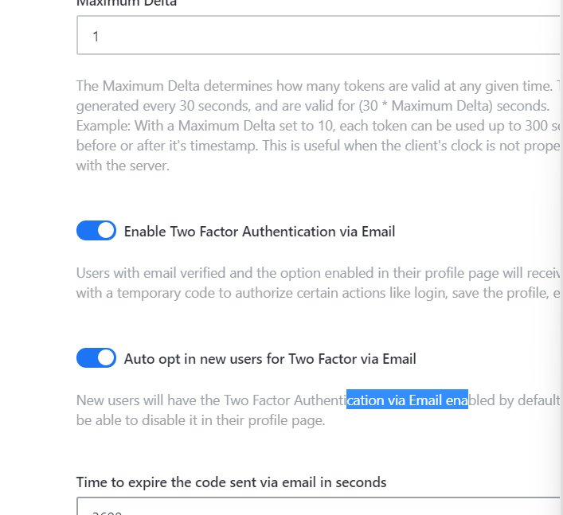{ #fig:011 width=70%, height=70% }

## Уязвимый узел: RocketChat

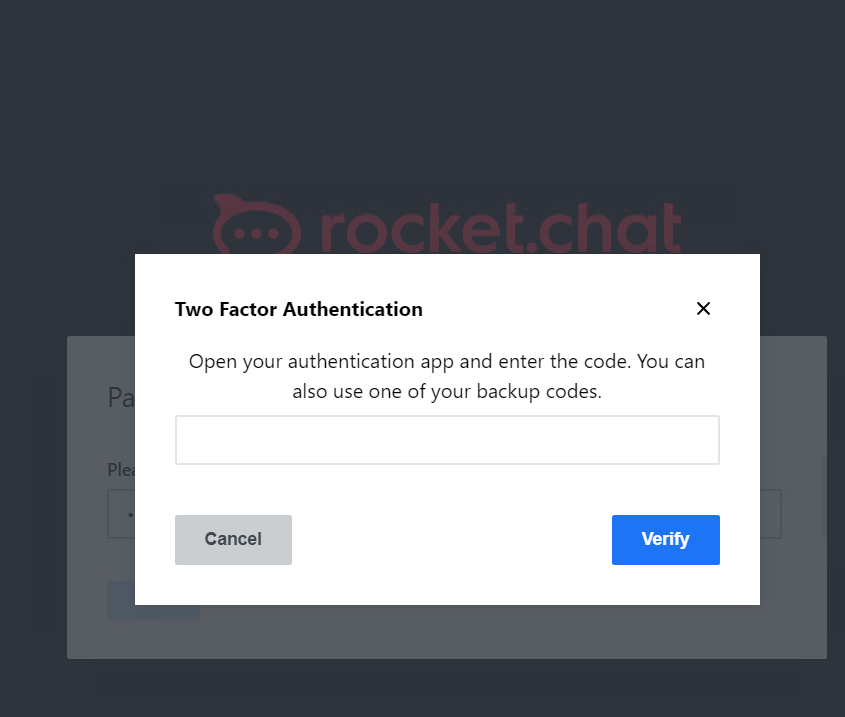{ #fig:014 width=70%, height=70% }

## Уязвимый узел: RocketChat

{ #fig:018 width=70%, height=70% }

## Уязвимый узел: RocketChat

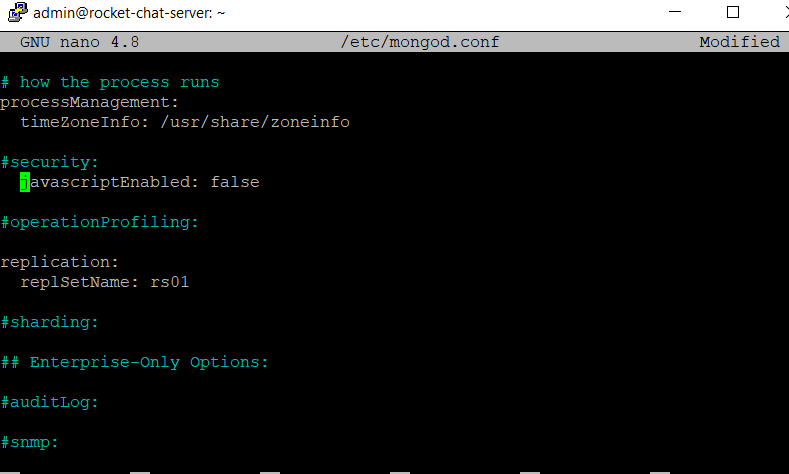{ #fig:015 width=70%, height=70% }

## Уязвимый узел: RocketChat

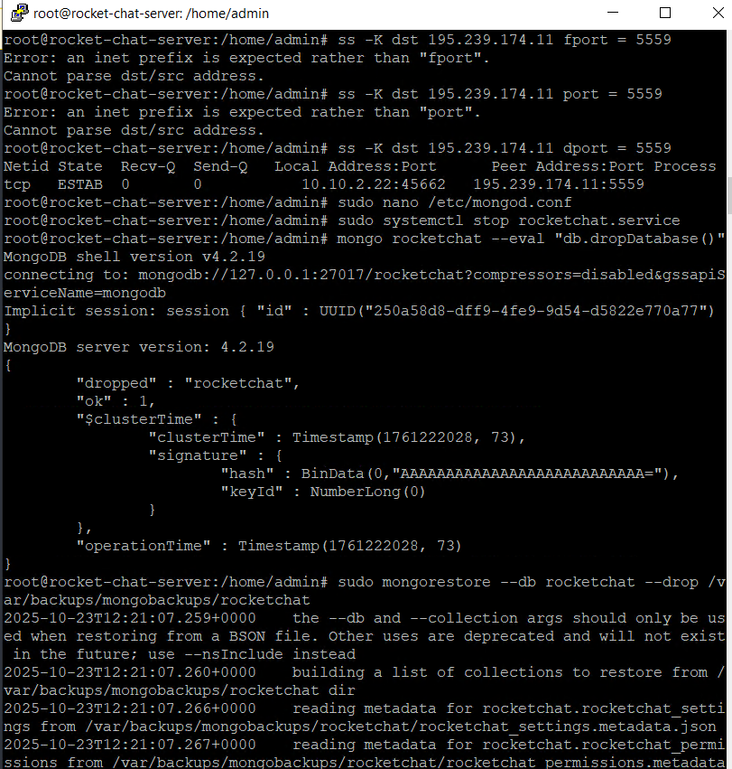{ #fig:019 width=70%, height=70% }

## Проверка устранения

- Успешная аутентификация с двухфакторной проверкой
- Отсутствие вредоносных соединений
- Корректная работа всех функций RocketChat

# Уязвимый узел: Proxylogon

## Уязвимый узел: Proxylogon

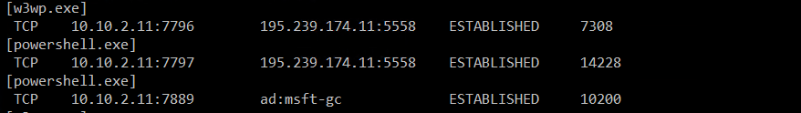{ #fig:007 width=70%, height=70% }

## Уязвимый узел: Proxylogon

{ #fig:005 width=70%, height=70% }

## Уязвимый узел: Proxylogon

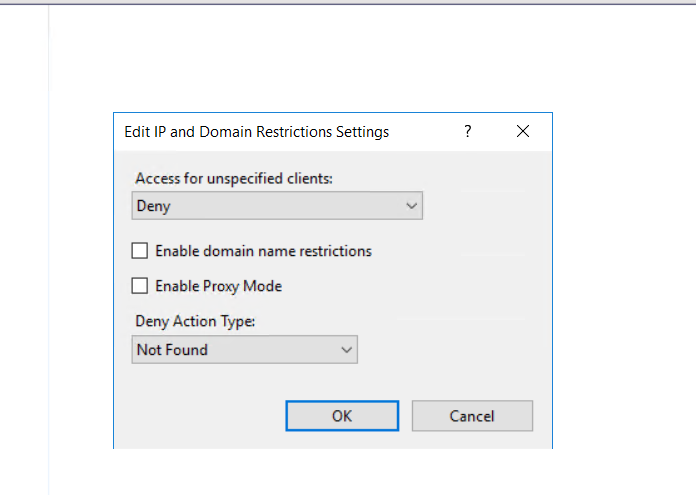{ #fig:006 width=70%, height=70% }

## Уязвимый узел: Proxylogon

{ #fig:008 width=70%, height=70% }

## Проверка устранения

- Отсутствие несанкционированных подключений
- Невозможность доступа к /ecp извне
- Отсутствие вредоносных файлов и процессов

## Выводы

В ходе лабораторной работы успешно проанализированы и нейтрализованы уязвимости трех различных веб-приложений:

1. **WpDiscuz** - уязвимость типа RCE через загрузку файлов
2. **RocketChat** - комбинация NoSQL-инъекции и уязвимости ядра ОС  
3. **Proxylogon** - комплексная атака на Exchange Server

## Завершение работы

{ #fig:030 width=70%, height=70% }

## Завершение работы

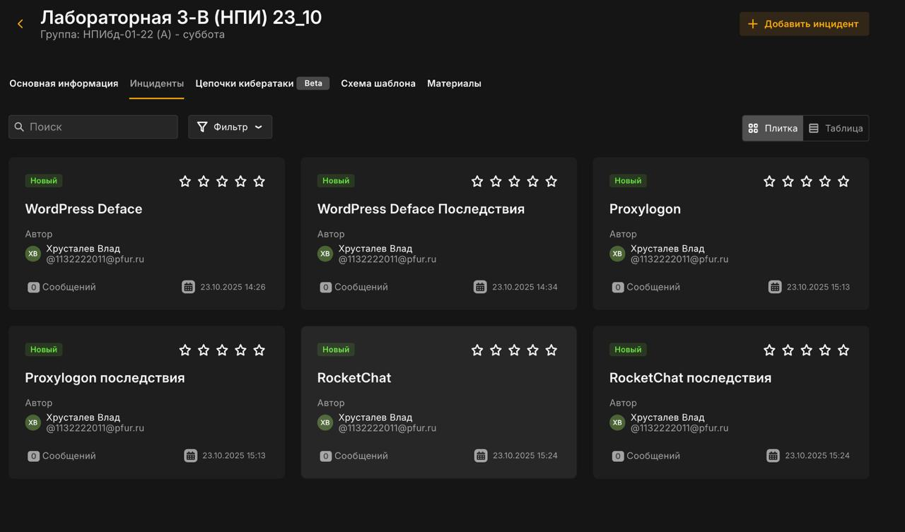{ #fig:031 width=70%, height=70% }
