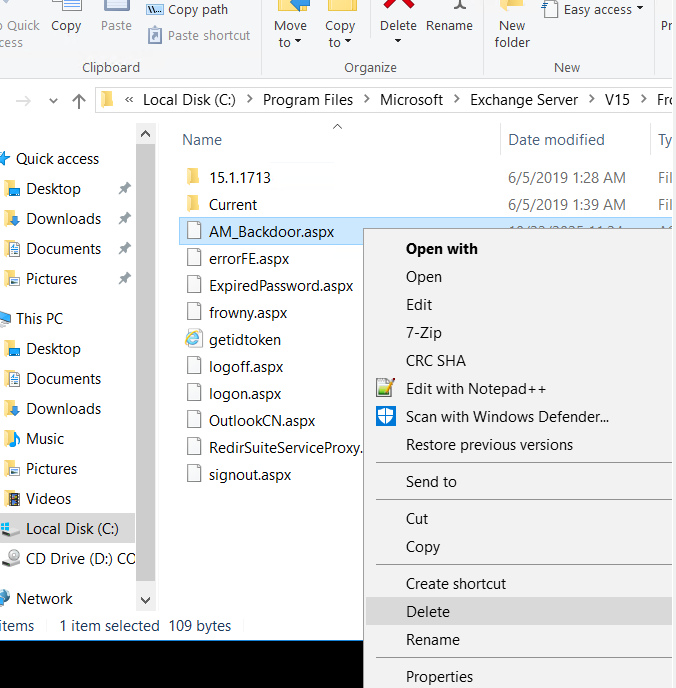
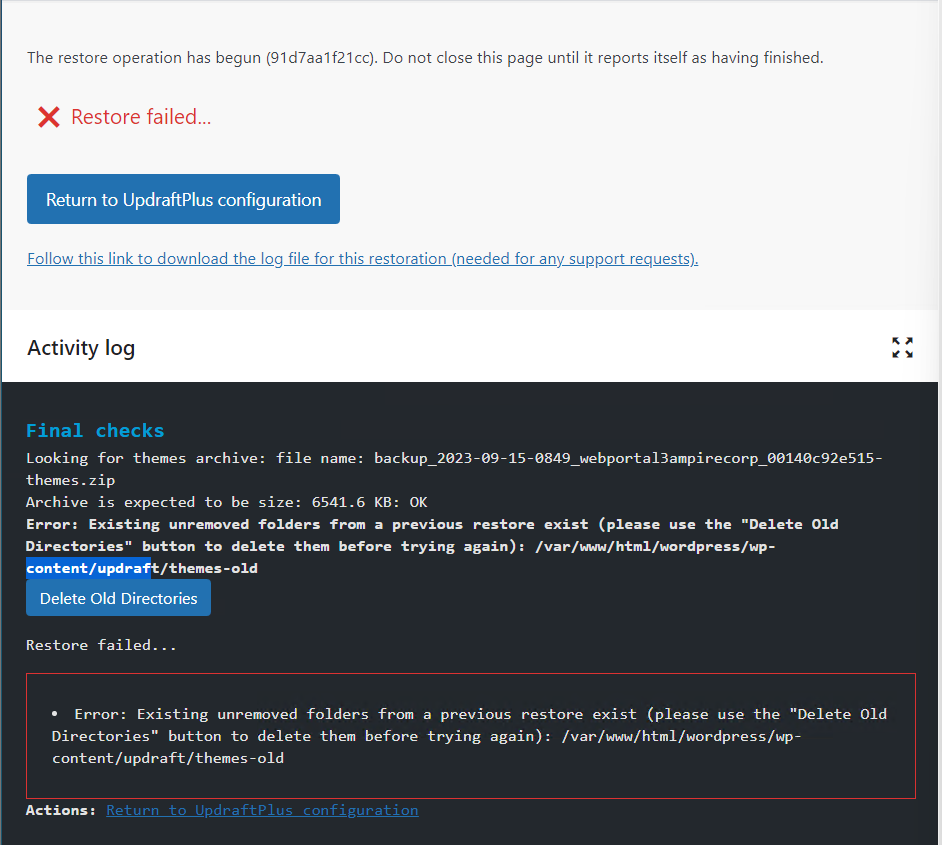
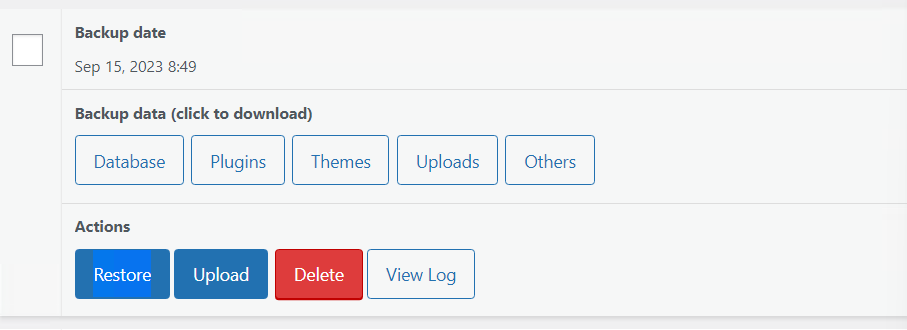
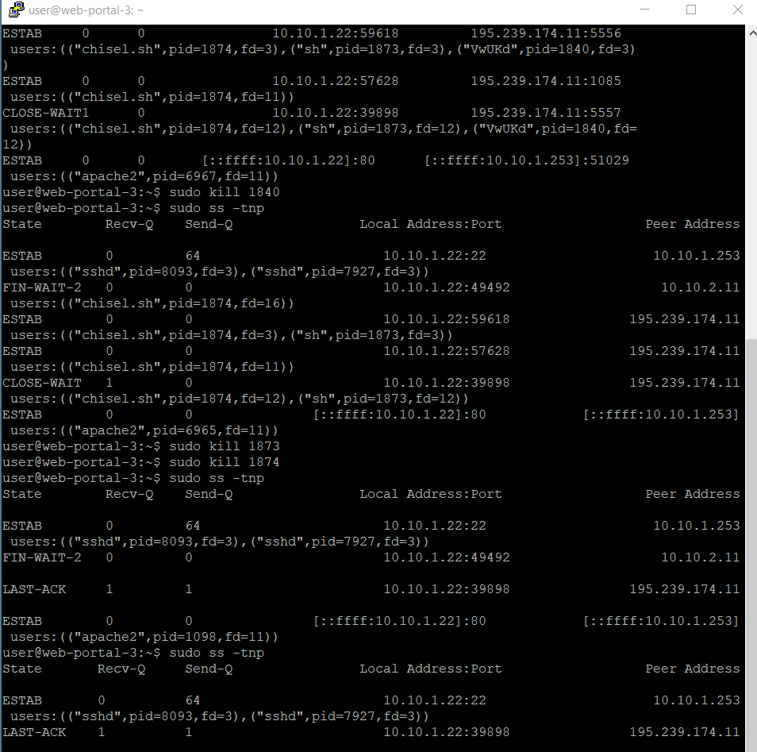
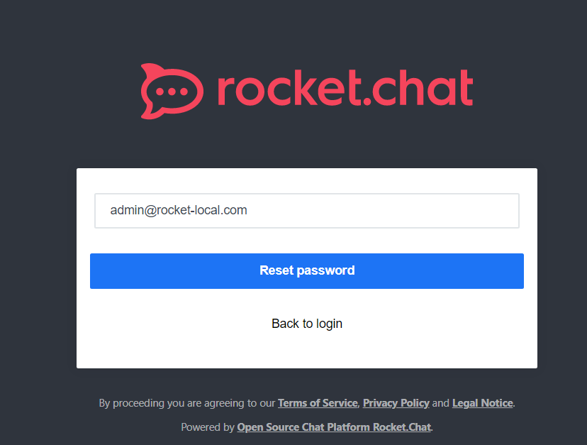
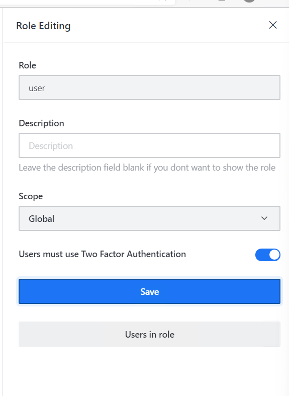
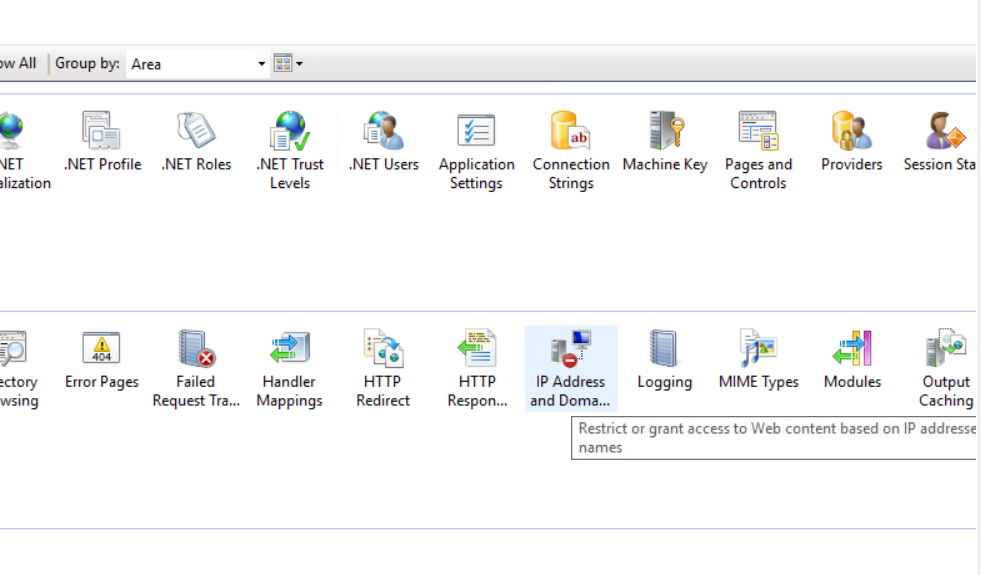
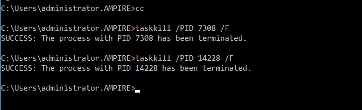
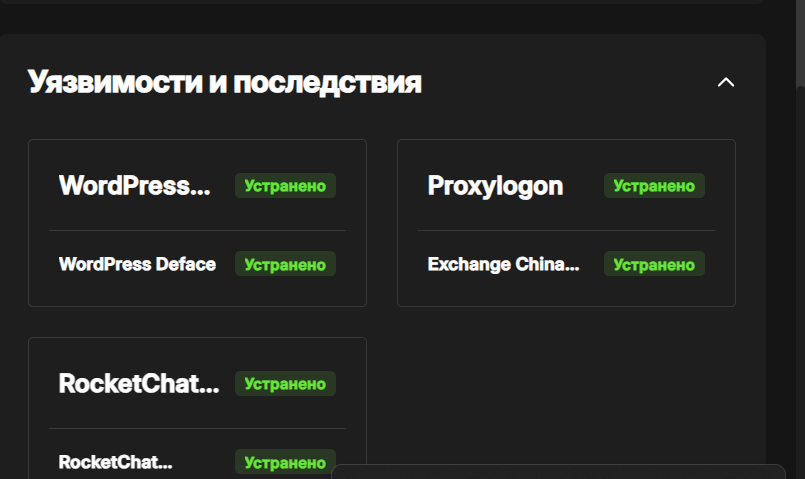

---
## Front matter
title: "Отчет по лабораторной работе №3"
subtitle: "Дисциплина: Кибербезопасность предприятия"
author:
  - "Боровиков Даниил"
  - "Хрусталев Влад" 
  - "Гисматуллин Артём"
  - "Чесноков Артёмий"
  - "Коннова Татьяна"
  - "Нефедова Наталья"
  - "Уткина Алина"
  - "Бансимба Клодели"
  
## Generic otions
lang: ru-RU
toc-title: "Содержание"

## Bibliography
bibliography: bib/cite.bib
csl: pandoc/csl/gost-r-7-0-5-2008-numeric.csl

## Pdf output format
toc: true # Table of contents
toc-depth: 2
lof: true # List of figures
lot: true # List of tables
fontsize: 12pt
linestretch: 1.5
papersize: a4
documentclass: scrreprt
## I18n polyglossia
polyglossia-lang:
  name: russian
  options:
	- spelling=modern
	- babelshorthands=true
polyglossia-otherlangs:
  name: english
## I18n babel
babel-lang: russian
babel-otherlangs: english
## Fonts
mainfont: IBM Plex Serif
romanfont: IBM Plex Serif
sansfont: IBM Plex Sans
monofont: IBM Plex Mono
mathfont: STIX Two Math
mainfontoptions: Ligatures=Common,Ligatures=TeX,Scale=0.94
romanfontoptions: Ligatures=Common,Ligatures=TeX,Scale=0.94
sansfontoptions: Ligatures=Common,Ligatures=TeX,Scale=MatchLowercase,Scale=0.94
monofontoptions: Scale=MatchLowercase,Scale=0.94,FakeStretch=0.9
mathfontoptions:
## Biblatex
biblatex: true
biblio-style: "gost-numeric"
biblatexoptions:
  - parentracker=true
  - backend=biber
  - hyperref=auto
  - language=auto
  - autolang=other*
  - citestyle=gost-numeric
## Pandoc-crossref LaTeX customization
figureTitle: "Рис."
tableTitle: "Таблица"
listingTitle: "Листинг"
lofTitle: "Список иллюстраций"
lotTitle: "Список таблиц"
lolTitle: "Листинги"
## Misc options
indent: true
header-includes:
  - \usepackage{indentfirst}
  - \usepackage{float} # keep figures where there are in the text
  - \floatplacement{figure}{H} # keep figures where there are in the text
---

# Введение

В рамках лабораторной работы проведен анализ трех уязвимых узлов с различными типами уязвимостей. Использовались инструменты мониторинга и защиты: ViPNet IDS NS, Security Onion, а также встроенные средства операционных систем для обнаружения и нейтрализации атак.

## Используемые инструменты

- **ViPNet IDS NS** - обнаружение сетевых атак
- **Security Onion** - мониторинг сетевой безопасности
- **Системные утилиты** (ss, netstat, taskkill) - анализ процессов и соединений

---

# Уязвимый узел: WpDiscuz

## Описание уязвимости

**CVE-2020-24186** - уязвимость удаленного выполнения кода в плагине WordPress WpDiscuz версий 7.0.0-7.0.4. Позволяет загружать произвольные PHP-файлы через функционал комментариев без аутентификации.

### Обнаружение уязвимости

- Обнаружена активная версия плагина 7.0.2 (рис. [-@fig:002])
- Выявлены вредоносные файлы в директории веб-сервера (рис. [-@fig:001])


## Эксплуатация и последствия

- Устранение backdoor-файлов (AM_Backdoor.aspx) (рис. [-@fig:001])
- Установление обратных соединений с хостом нарушителя
- Изменение содержимого веб-сайта

{ #fig:001 width=70%, height=70% }

## Устранение уязвимости

1. **Деактивация уязвимого плагина** (рис. [-@fig:002])
2. **Восстановление из резервной копии** через плагин UpdraftPlus (рис. [-@fig:003], рис. [-@fig:012], (рис. [-@fig:027])
3. **Завершение вредоносных соединений**:
   ```bash
   sudo kill 1840
   sudo kill 1873  
   sudo kill 1874
   sudo ss -tmp
   ```
(рис. [-@fig:004])
   
{ #fig:002 width=70%, height=70% }

{ #fig:003 width=70%, height=70% }

{ #fig:012 width=70%, height=70% }

{ #fig:027 width=70%, height=70% }

{ #fig:004 width=70%, height=70% }

### Проверка устранения

- Отсутствие активных соединений с хостом нарушителя
- Восстановлена оригинальная версия сайта
- Плагин деактивирован или обновлен

---

# Уязвимый узел: RocketChat

## Описание уязвимостей

1. **CVE-2021-22911** - NoSQL-инъекция, позволяющая повышение привилегий
2. **CVE-2022-0847** (Dirty Pipe) - уязвимость повышения привилегий в ядре Linux

## Обнаружение уязвимостей

- Обнаружены подозрительные запросы в логах RocketChat
- Выявлены несанкционированные подключения к БД (рис. [-@fig:021])

{ #fig:021 width=70%, height=70% }

## Эксплуатация и последствия

- Несанкционированный доступ к учетной записи администратора
- Создание backdoor-соединений (рис. [-@fig:016])
- Модификация системных файлов

{ #fig:016 width=70%, height=70% }

## Устранение уязвимостей

1. **Сброс пароля администратора** через почтовое уведомление (рис. [-@fig:009], рис. [-@fig:013])

{ #fig:009 width=70%, height=70% }

{ #fig:013 width=70%, height=70% }

2. **Настройка двухфакторной аутентификации** (рис. [-@fig:011], рис. [-@fig:014], рис. [-@fig:018])

{ #fig:011 width=70%, height=70% }

{ #fig:014 width=70%, height=70% }

{ #fig:018 width=70%, height=70% }

3. **Отключение выполнения JavaScript в MongoDB**:
   ```yaml
   security:
     javascriptEnabled: false
   ```
   (рис. [-@fig:015])

{ #fig:015 width=70%, height=70% }

4. **Восстановление базы данных** из резервной копии:
   ```bash
   sudo systemctl stop rocketchat.service
   mongo rocketchat --eval "db.dropDatabase()"
   sudo mongorestore --db rocketchat --drop /var/backups/mongobackups/rocketchat
   ```
   (рис. [-@fig:019])

{ #fig:019 width=70%, height=70% }

## Проверка устранения
- Успешная аутентификация с двухфакторной проверкой
- Отсутствие вредоносных соединений
- Корректная работа всех функций RocketChat

---

# Уязвимый узел: Proxylogon

## Описание уязвимостей
1. **CVE-2021-26855** - SSRF-уязвимость в Exchange Server
2. **CVE-2021-27065** - возможность записи файлов в произвольные директории

## Обнаружение уязвимостей
- Выявлены подозрительные запросы к /ecp (рис. [-@fig:021])
- Обнаружены backdoor-файлы в системных директориях 

## Эксплуатация и последствия
- Создание веб-оболочек (China Chopper)
- Установление meterpreter-сессий (рис. [-@fig:007])
- Модификация реестра Windows
- Создание вредоносных служб

{ #fig:007 width=70%, height=70% }

## Устранение уязвимостей

1. **Блокировка доступа к /ecp** через IP restrictions в IIS (рис. [-@fig:005], (рис. [-@fig:006]))

{ #fig:005 width=70%, height=70% }

{ #fig:006 width=70%, height=70% }

2. **Завершение вредоносных процессов**:
   ```cmd
   taskkill /PID 7308 /F
   taskkill /PID 14228 /F
   ```
   (рис. [-@fig:008])
   
{ #fig:008 width=70%, height=70% }

3. **Удаление backdoor-файлов** из системных директорий 

## Проверка устранения
- Отсутствие несанкционированных подключений
- Невозможность доступа к /ecp извне
- Отсутствие вредоносных файлов и процессов

---

# Общие выводы

В ходе лабораторной работы успешно проанализированы и нейтрализованы уязвимости трех различных веб-приложений:

1. **WpDiscuz** - уязвимость типа RCE через загрузку файлов
2. **RocketChat** - комбинация NoSQL-инъекции и уязвимости ядра ОС  
3. **Proxylogon** - комплексная атака на Exchange Server

**Ключевые результаты:**
- Освоены методы обнаружения и анализа различных типов уязвимостей
- Приобретены навыки работы с системами мониторинга (ViPNet IDS NS, Security Onion)
- Отработаны методики устранения последствий компрометации
- Получен опыт восстановления систем после кибератак

Отчет о выполненной работе (рис. [-@fig:030]) и заполненных инцидентов (рис. [-@fig:031])

{ #fig:030 width=70%, height=70% }

{ #fig:031 width=70%, height=70% }
