---
## Front matter
lang: ru-RU
title: Лабораторная работа №4
subtitle: Кибербезопасность предприятия
author:
  - Боровиков Даниил
  - Хрусталев Влад 
  - Гисматуллин Артём
  - Чесноков Артёмий
  - Коннова Татьяна
  - Нефедова Наталья
  - Уткина Алина
  - Бансимба Клодели

institute:
  - Российский университет дружбы народов, Москва, Россия

## i18n babel
babel-lang: russian
babel-otherlangs: english

## Formatting pdf
toc: false
toc-title: Содержание
slide_level: 2
aspectratio: 169
section-titles: true
theme: metropolis
header-includes:
 - \metroset{progressbar=frametitle,sectionpage=progressbar,numbering=fraction}
 - '\makeatletter'
 - '\beamer@ignorenonframefalse'
 - '\makeatother'
 
## Fonts
mainfont: PT Serif
romanfont: PT Serif
sansfont: PT Sans
monofont: PT Mono
mainfontoptions: Ligatures=TeX
romanfontoptions: Ligatures=TeX
sansfontoptions: Ligatures=TeX,Scale=MatchLowercase
monofontoptions: Scale=MatchLowercase,Scale=0.9
---

## Задачи

Получить доступ к контроллеру домена и найти флаг в свойствах доменного пользователя «Flag» **в рамках сценария №3**

## Исходные данные

- Внешний IP: 195.239.174.11 (атакующая машина)
- Целевые хосты: 
  - WordPress портал: 195.239.174.25
  - Почтовый сервер: 195.239.174.1
  - Контроллер домена: 10.10.10.20
- Домен: ampire.corp

# Процесс выполнения лабораторной работы

## Получение начального доступа

{ #fig:001 width=70%, height=70% }

## Получение начального доступа

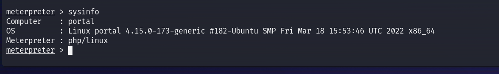{ #fig:002 width=70%, height=70% }

## Получение начального доступа

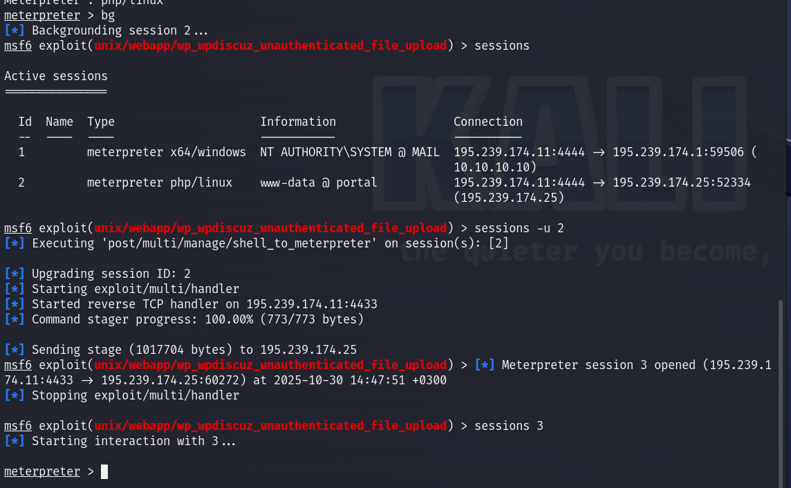{ #fig:003 width=70%, height=70% }

## Разведка внутренней сети

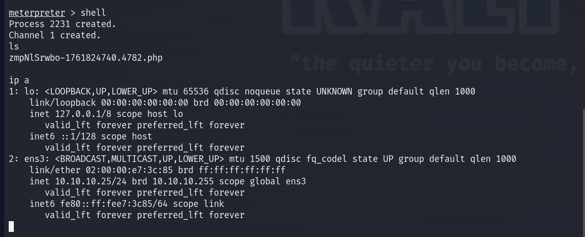{ #fig:004 width=70%, height=70% }

## Разведка внутренней сети

{ #fig:005 width=70%, height=70% }

## Разведка внутренней сети

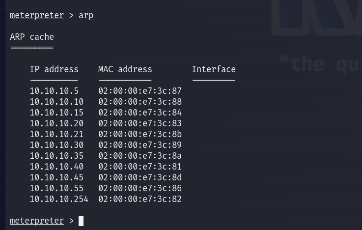{ #fig:006 width=70%, height=70% }

## Настройка маршрутизации

{ #fig:007 width=70%, height=70% }

## Настройка маршрутизации

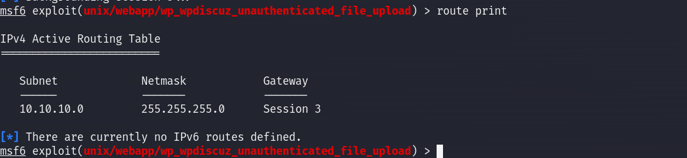{ #fig:008 width=70%, height=70% }

## Настройка SOCKS прокси

{ #fig:009 width=70%, height=70% }

## Настройка SOCKS прокси

{ #fig:010 width=70%, height=70% }

## Атака на контроллер домена

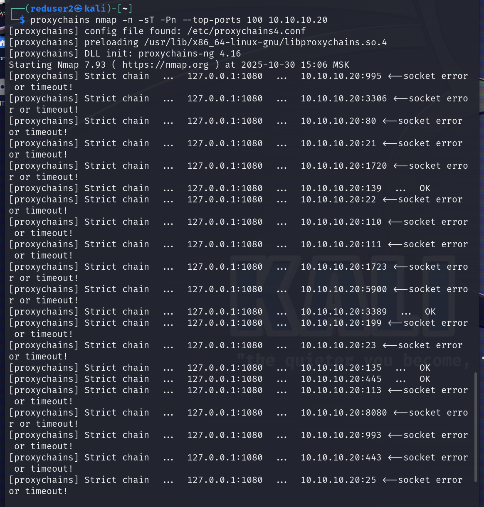{ #fig:011 width=70%, height=70% }

## Атака на контроллер домена

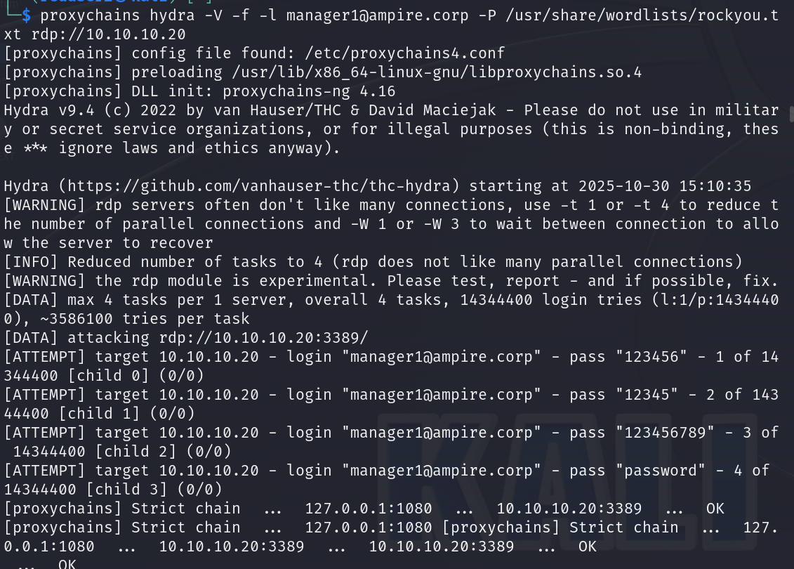{ #fig:012 width=70%, height=70% }

## Атака на контроллер домена

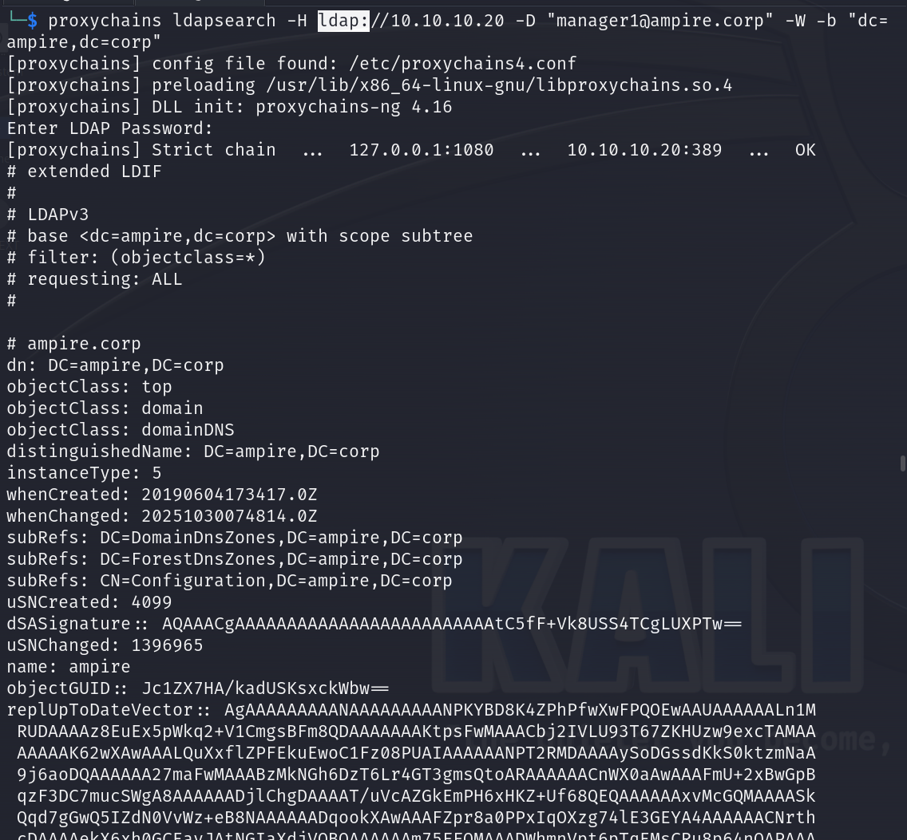{ #fig:013 width=70%, height=70% }

## Атака на контроллер домена

{ #fig:014 width=70%, height=70% }

## Атака на контроллер домена

{ #fig:015 width=70%, height=70% }

## Атака на контроллер домена

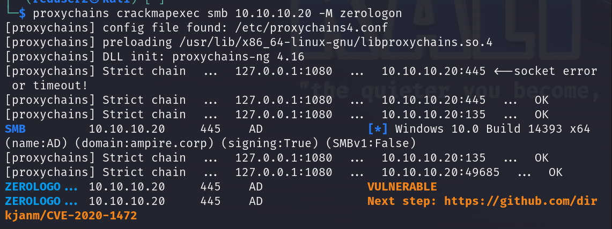{ #fig:016 width=70%, height=70% }

## Атака на контроллер домена

{ #fig:017 width=70%, height=70% }

## Атака на контроллер домена

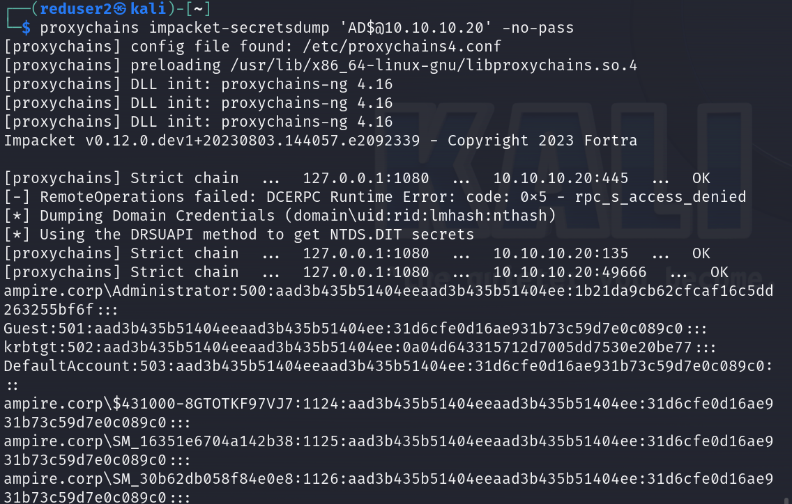{ #fig:018 width=70%, height=70% }

## Атака на контроллер домена

{ #fig:019 width=70%, height=70% }

## Получение флага

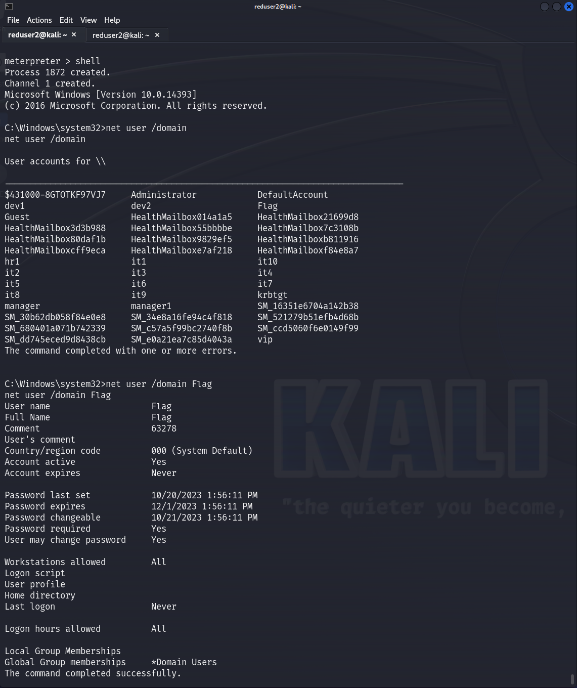{ #fig:020 width=70%, height=70% }

## Выводы

1. **Начальный доступ** - получен через уязвимость в WordPress плагине
2. **Разведка сети** - обнаружена внутренняя сеть 10.10.10.0/24
3. **Туннелирование** - настроены маршруты и SOCKS прокси
4. **Обнаружение цели** - идентифицирован контроллер домена 10.10.10.20
5. **Multiple attack vectors**:
   - Успешный bruteforce RDP
   - Поиск через LDAP
   - Эксплуатация критической уязвимости Zerologon
6. **Эскалация привилегий** - получен полный доступ к домену
7. **Достижение цели** - найден флаг **63278**

